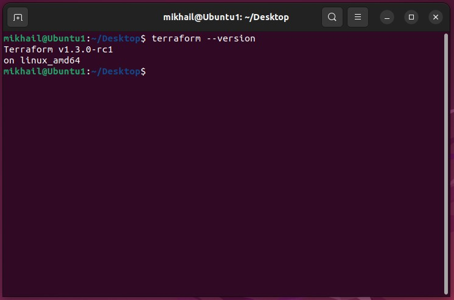

## Домашнее задание к занятию "7.1. Инфраструктура как код" ##

### Задача 1. Выбор инструментов. ###

### Легенда ###
#### Через час совещание на котором менеджер расскажет о новом проекте. Начать работу над которым надо будет уже сегодня. На данный момент известно, что это будет сервис, который ваша компания будет предоставлять внешним заказчикам. Первое время, скорее всего, будет один внешний клиент, со временем внешних клиентов станет больше. ####
#### Так же по разговорам в компании есть вероятность, что техническое задание еще не четкое, что приведет к большому количеству небольших релизов, тестирований интеграций, откатов, доработок, то есть скучно не будет. ####
#### Вам, как девопс инженеру, будет необходимо принять решение об инструментах для организации инфраструктуры. На данный момент в вашей компании уже используются следующие инструменты: ####

 - остатки Сloud Formation, 
 - некоторые образы сделаны при помощи Packer, 
 - год назад начали активно использовать Terraform, 
 - разработчики привыкли использовать Docker, ####
 - уже есть большая база Kubernetes конфигураций,
 - для автоматизации процессов используется Teamcity, 
 - также есть совсем немного Ansible скриптов, 
 - и ряд bash скриптов для упрощения рутинных задач. 
#### Для этого в рамках совещания надо будет выяснить подробности о проекте, что бы в итоге определиться с инструментами: ####
 
#### 1. Какой тип инфраструктуры будем использовать для этого проекта: изменяемый или не изменяемый? ####

Будем преимущественно использовать неизменяемый тип инфраструктуры, так как большинство уже используемых инструментов, предназначено для развёртывания инфраструктуры именно такого типа. Изменяемый - только в качестве исключения, если без этого не обойтись

#### 2. Будет ли центральный сервер для управления инфраструктурой? ####

Не будет использоваться - существующие инструменты ( CloudFormation, Terraform, ansible) не имееют центрального сервера 

#### 3. Будут ли агенты на серверах? #### 

Агентов не будет, так как используем контейнеризацию и инструментарий без агентов (Terraform, Сloud Formation). Для настройки неконтейнеризируемых ресурсов (например, сервер ElasticSearch) можно использовать Packer для создния готового образа ВМ, либо использовать Ansible. 

#### 4. Будут ли использованы средства для управления конфигурацией или инициализации ресурсов? ####

Будут использоваться. Какие - описано в следующем вопросе.

#### Какие инструменты из уже используемых вы хотели бы использовать для нового проекта? ####

Из инструментов управления инициализацией будет использоваться Terraform. От "остатков Сloud Formation" целесообразно отказаться в пользу Terraform,  чтобы снизить затраты на сопровождение двух систем инициализации.
Для контейнеризации ресурсов будут использоваться Docker и Kubernetes
Для неконтейнеризируемых ресурсов будет использоваться создание образов с помощью Packer + если необходимо, настройка с помощью Ansible.
Из инструментов управления конфигурациями логично использовать уже имеющийся Ansible
Из средств автоматизации - TeamCity

#### Хотите ли рассмотреть возможность внедрения новых инструментов для этого проекта? ####

На начальном этапе не вижу смысла использовать дополнительные инструменты, так как уже имеется весь стек необходимых инструментов, а внедрение новых требует дополнительных трудозатрат. Решение о внедрении новых инструментов будет приниматься по мере внедрения проекта.

###  Задача 2. Установка терраформ. ### 

####  Установите терраформ при помощи менеджера пакетов используемого в вашей операционной системе. В виде результата этой задачи приложите вывод команды terraform --version. #### 

###  Задача 3. Поддержка легаси кода. ###  

#### В какой-то момент вы обновили терраформ до новой версии, например с 0.12 до 0.13. А код одного из проектов настолько устарел, что не может работать с версией 0.13. В связи с этим необходимо сделать так, чтобы вы могли одновременно использовать последнюю версию терраформа установленную при помощи штатного менеджера пакетов и устаревшую версию 0.12. ####
#### В виде результата этой задачи приложите вывод --version двух версий терраформа доступных на вашем компьютере или виртуальной машине. #### 

Помимо уже установленной версии 1.3.0. скачал, для примера, дистрибутив 1.1.9. Распаковал его, переименовал в terraform119 и поместил в /usr/bin

